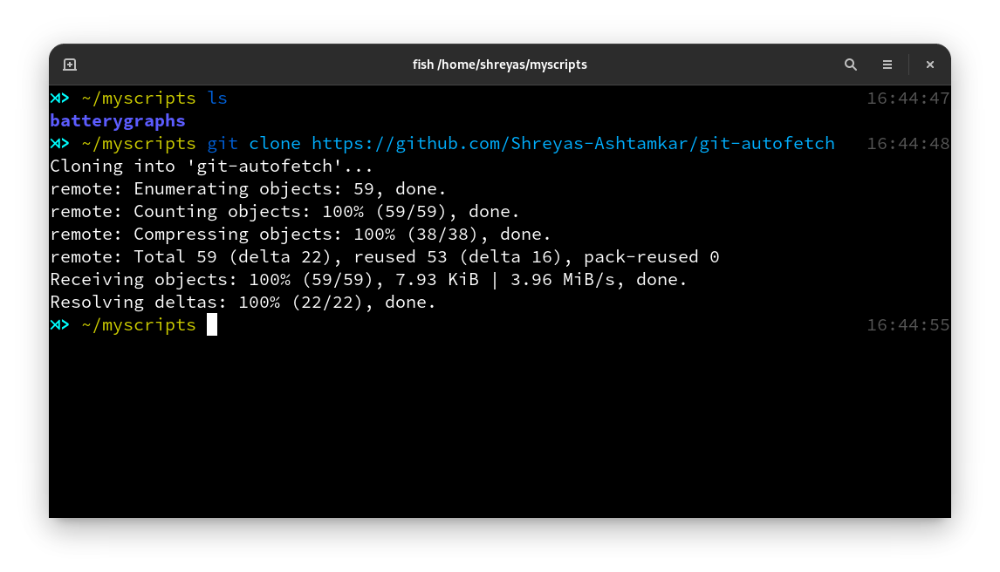
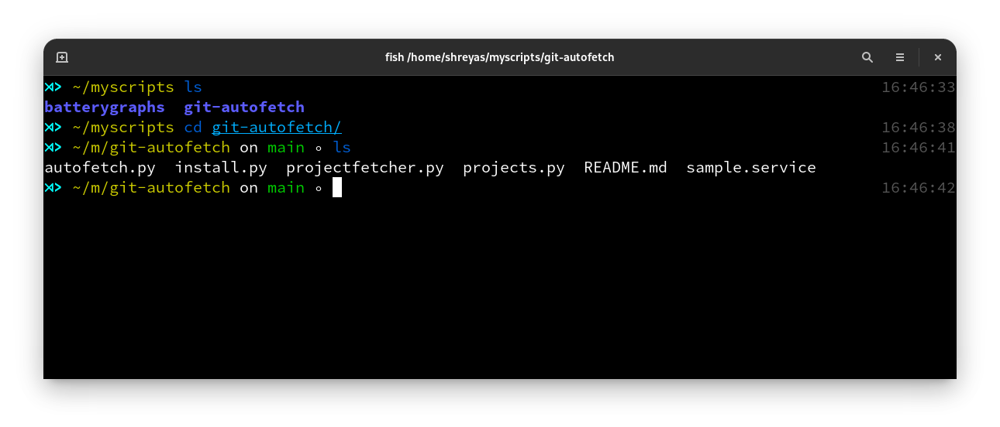
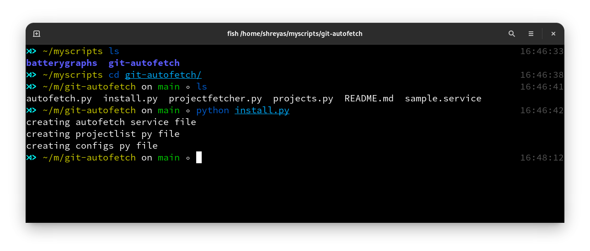
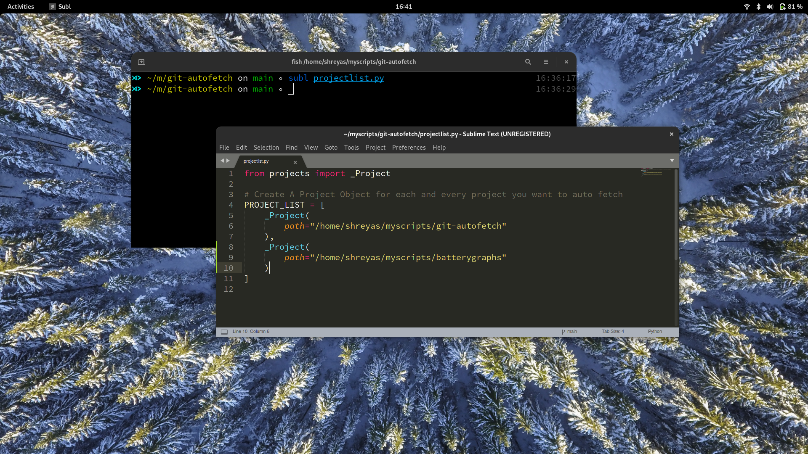
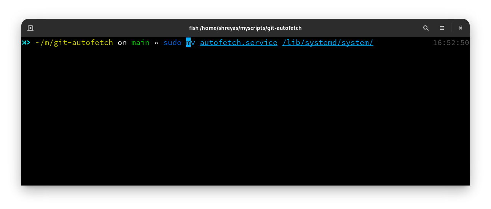
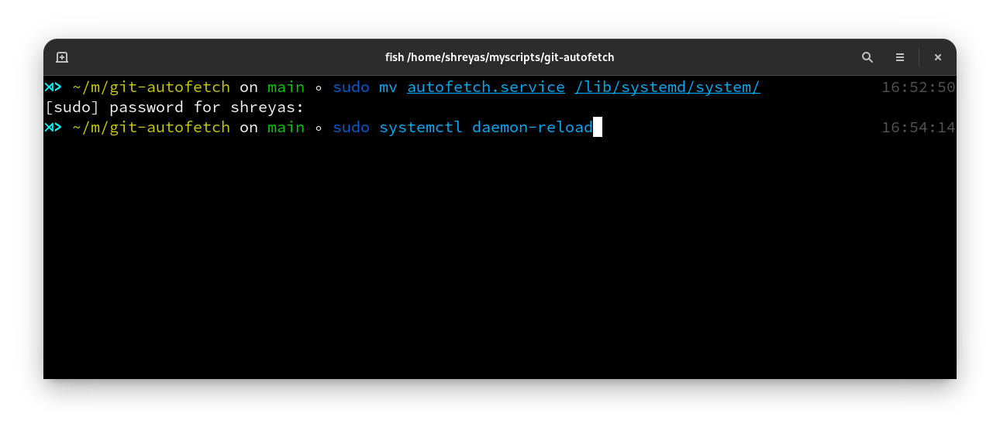
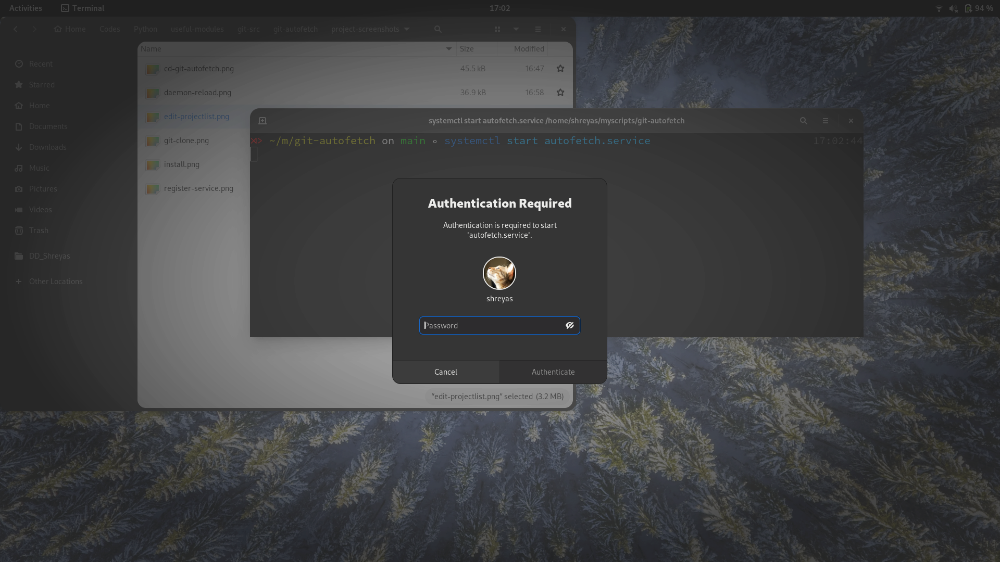
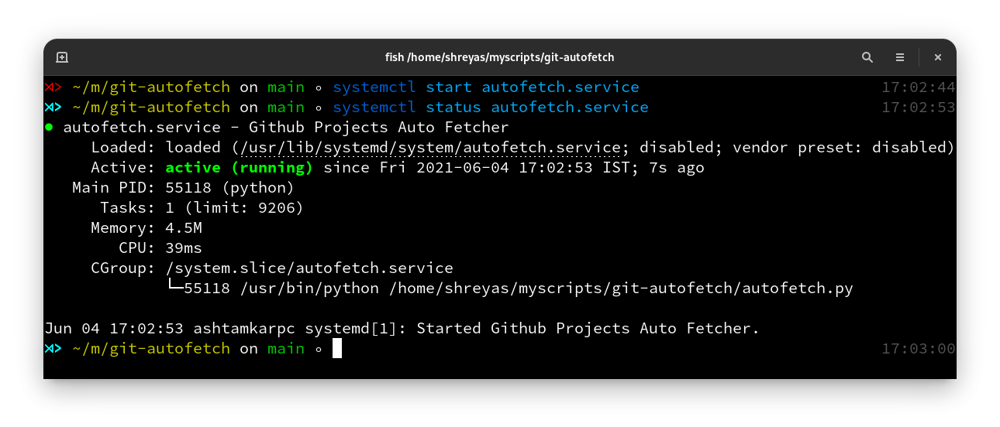

# git-autofetch
A simple script to automatically update the selected github repositories on a set time interval, very usefull for sending code to Raspberry-Pi

## USAGE
1. Clone this repo.
    

2. cd into the repo
    

3. Run the install.py.
    

4. Register Projects in the newly created projectlist.py
    
    

5. Move the newly created autofetcher.service to systemd's folders.
    
    run `sudo mv autofetch.service /lib/systemd/system/`
    

6. Reload the systemd daemon.
    
    run `sudo systemctl daemon-reload`
    

7. Start the service autofetcher.service

    run `sudo systemctl start autofetcher`
    

8. Check the status of autofetcher service

    run `sudo systemctl status autofetcher`
    

8. (optional) Enable the service autofetcher

    run `sudo systemctl enable autofetcher`
